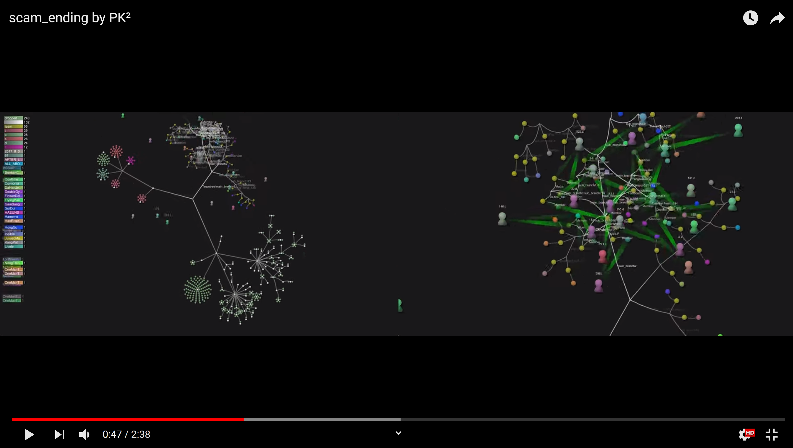

# ScamEnding by PK²

#### This is visualization work 
#### We used behavioral data from players on the [StartupCampus](https://www.gstartupcampus.or.kr/) Signature course 2

> '스캠엔딩'은 [StartupCampus](https://www.gstartupcampus.or.kr/) 시그니처 코스 2기 선수들의 행동(history) 데이터로 시각화를 진행한 작업입니다.  
> 스타트업캠퍼스는 스타트업을 하고 싶은 청년들(선수)이 모여 함께 팀을 만들고 생각을 공유하는 곳입니다.  
> 선수들이 스타트업캠퍼스에서 함께 성장하는 모습을 Git의 branch가 merge되고 tree를 만드는 구조에 투영시켜 보았습니다.  
> 선수들은 자신들의 뿌리(root 각자의 지역)에서 출발하여 스타트업캠퍼스의 과정들을 통해 가지(branch)를 뻗어나가고 최종적으로 열매(commit)를 맺는 과정을 보여줍니다.  
> 따라서 파일들의 내용보다는 Git의 history에 중점을 두고 작업하였습니다.  
> [Gource](https://gource.io)라는 Git 시각화 도구를 사용하였으며, 자세한 내용은 [링크](https://gource.io)를 통해 확인할 수 있습니다.   

>The StartupCampus is the place where the people(players) who want to be a entrepreneur.  
>The players are organizing the team and share ideas.  
>We used [Gource](https://gource.io), Gource is animated tree with the root directory of the project at its centre.   
>Directories appear as branches with files as leaves.   
>Developers can be seen working on the tree at the times they contributed to the project.  

##### 자, 이제 아래의 영상을 통해 결과를 확인해보세요.   

##### just enjoy

